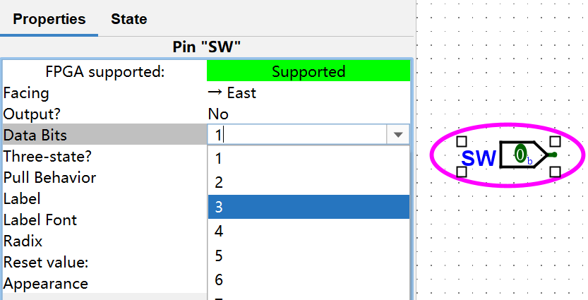
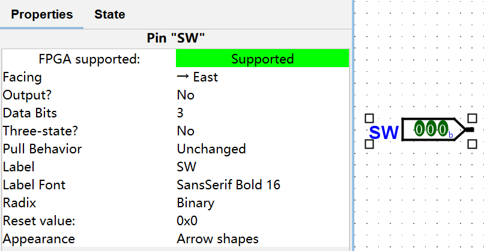
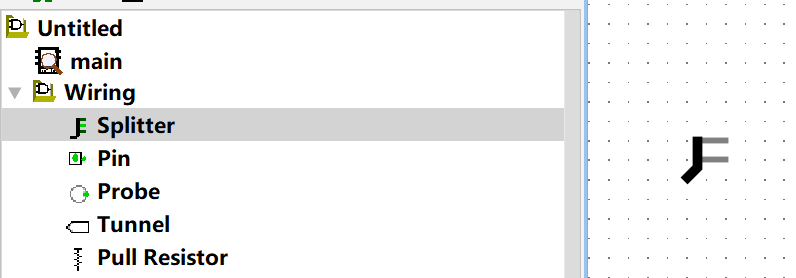
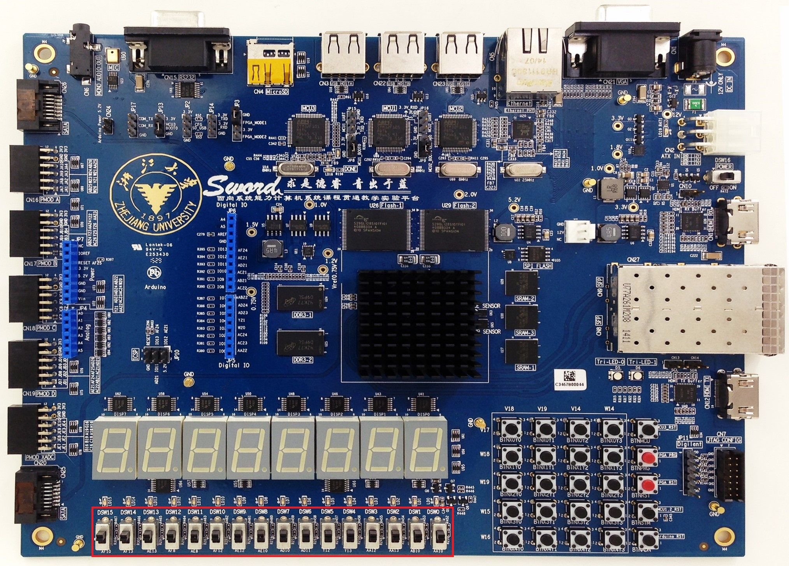

# 实验五  译码器设计与开关、LED 交互的应用

## 一    实验目的

1. 进一步熟悉 Logisim Evolution 和 Vivado 的使用方法
2. 初步了解 Verilog 仿真激励代码的编写
3. 了解 Sword 开发板的开关交互和 LED 交互

## 二    实验环境

1. EDA 工具： Logisim Evolution、Vivado
2. SWORD 开发板
3. 操作系统： Windows 10+

## 三    实验原理

### 1. Verilog 仿真激励的编写

此处，以上一个实验使用的仿真激励代码为例，简要说明仿真激励代码的编写方式：

- 编写仿真激励，需要创建一个激励模块，随后在这个激励模块中实例化一个被测模块，并且给被测模块的输入赋值。如：

```verilog
module main_sim();
    
    // 实例化被测模块
    reg [2:0] i;
    wire o0, o1, o2, o3;
    main uut(.I0(i[0]), .I1(i[1]), .I2(i[2]), .O0(o0), .O1(o1), .O2(o2), .O3(o3));
    
    // 给被测模块的输入赋值
    initial 
        for (i = 3'b0; 1; i = i+1) #100;
    
endmodule
```

- 其中，下面这一段进行的是变量的定义：

```verilog
    reg [2:0] i;
    wire o0, o1, o2, o3;
```

Verilog 中有两个基本数据类型：线网（`wire`）和寄存器（`reg`）。其中，线网类型表示硬件单元之间的物理连线，寄存器类型用于表示存储单元。为了方便给模块的输入赋值，用作输入的信号通常定义为寄存器类型。

其中 `reg [2:0] i;` 表示定义了一个最高位为 2，最低位为 0 的向量变量。未声明为向量的变量都只有 1 bit，声明为向量的变量则根据定义的最高位和最低位来确定其位宽（如前面那个语句定义的变量 i 即有 3 bit）。

- 下面这一行进行的是被测模块的实例化：

```verilog
    main uut(.I0(i[0]), .I1(i[1]), .I2(i[2]), .O0(o0), .O1(o1), .O2(o2), .O3(o3));
```

这一行当中，`main` 是被测模块的模块名，`uut` 是被测模块在激励模块中实例化后的实例名。`.I0(i[0])` 表示 `main` 模块的 `I0` 接口在 `uut` 这一实例中接到 `i[0]` 这个信号上（`i[0]` 指 `i` 这个向量信号的最低位，即第 0 位）。将所有需要连接的接口都接到对应的信号上，即可完成该模块的实例化。

- 下面这一部分是对输入的赋值：

```verilog
    initial 
        for (i = 3'b0; 1; i = i+1) #100;
```

其中 `#100` 表示延时 100 ns。`initial` 表示下面的一个语句在仿真开始时执行一次。`for` 语句的含义与 C 语言中类似。

当我们需要仿真开始时执行多个语句时，可以用 `begin` 和 `end` 组成一个块语句接在 `initial` 关键字之后，如：

```verilog
    initial begin
        i = 3'd0;
    	#100;
        i = 3'd1;
        #100;
        i = 3'd2;
        #100;
        i = 3'd3;
    end
```

上面这段仿真激励代码的功能是：初始时将变量 `i` 置为 0，100 ns 后将 `i` 置为 1，又 100 ns 后将 `i` 置为 2，又 100 ns 后将 `i` 置为 3。

其中，`3'd0` 是 Verilog 中表示数值字面量的方式，`3'` 表示该字面量的位宽为 3，`d` 表示该字面量为十进制（对应地，有 `b` 表示二进制，`h` 表示十六进制），`0` 为该字面量的值。

与 `initial` 关键字相对应的 `always` 关键字。`always` 语句块从 0 时刻开始执行其中的行为语句；当执行完最后一条语句后，便再次执行语句块中的第一条语句，如此循环反复。如下面这段将 `clk` 信号的行为定义为一个周期为 10 ns 的时钟信号（其中 `~` 为按位非运算符）：

```verilog
    initial clk = 0;
    always begin
        clk = ~clk;
        #5;
    end
```

又如，使用如下的一段仿真激励代码即可验证 3 - 8 译码器模块的功能的正确性：

```verilog
module main_sim();
    
    reg [2:0] i;
    wire [7:0] o;
    
    // 将此处的模块名称和模块接口修改为你所使用的模块名称和模块接口
    main uut(.SW(i), .LED(o));
    
    initial 
        for (i = 3'b0; 1; i = i+1) #100;
    
endmodule
```

上面这段代码的功能是，每隔 100 ns 将输入译码器的信号的对应的二进制数加一，从而改变输入译码器的信号。我们可以根据这段代码生成的仿真激励波形中输入和输出的对应关系是否正确来判断 3 - 8 译码器的实现是否正确。

请注意，使用这段代码时，需要将其中的模块名称 `main` 和模块接口 `SW` 和 `LED` 改为你所使用的模块名称和接口。

### 2. Logisim 集线器的使用

在上一节涉及到了 Vivado 中的向量信号，这一节主要涉及 Logisim 中的向量信号。

例如，若要定义一个位宽为 3 的向量输入信号，则需创建一个输入端口，并在 Logisim 窗口左下方的 `Properties` 中将该端口的 `Data Bits` 改为 3：



修改完成后效果如下图所示：



同理，输出端口也可以如此修改：


向量端口不能直接接到门电路上，需要通过分流器，将向量端口中的每一位信号分出来才可以接到门电路上。

若要添加分流器，需要点击窗口左上方的 `Wiring -> Splitter`，随后在电路图中合适位置添加分流器即可。



添加分流器后，也可以在窗口左下方的 `Properties` 中对分流器进行修改：


同时，原理图中的其他元素（如门电路等）也可以通过窗口左下方的 `Properties` 来进行修改。例如，借助以上操作，可以完成 2 - 4 译码器的设计如下图：


### 3. 开关和子板 LED 交互的使用

为一位信号约定引脚约束，需要在引脚约束文件中为这一位信号指定 `PACKAGE_PIN`（引脚位置）以及 `IOSTANDARD`（引脚类型）。如下图中圈出的十六个开关中最右侧的一个开关的 `PACKAGE_PIN` 是 `AA10`，`IOSTANDARD` 是 `LVCMOS15`，则在引脚约束文件中添加如下两行即可将 `SW[0]` 约束到最右侧的开关，即可以使用最右侧的开关控制 `SW[0]` 的值：

```
set_property PACKAGE_PIN AA10       [get_ports SW[0]]
set_property IOSTANDARD LVCMOS15    [get_ports SW[0]]
```

上面这两行代码中，第一行用于给 `SW[0]` 信号指定 `PACKAGE_PIN`（引脚约束），第二行用于给 `SW[0]` 信号指定 `IOSTANDARD`（引脚类型）。



Sword 主板上开关共有 16 个，位置如上图所示，每个开关的引脚为开关下侧的编号，如最右侧的开关的引脚为 AA10。开关闭合（在上方）时，输入为 1，否则为 0。

Arduino 子板上 LED 灯共有 8 个，每个 LED 等的引脚为灯上方的编号，如最左侧的子板 LED 的引脚为 W23。输出为 1 时，灯亮，否则灯灭。

16 个开关和 8 个 LED 的引脚约束如右：[SW & LED](SW_LED.xdc)

## 四    实验步骤

### 1. 完成 3 - 8 译码器的原理图设计并仿真

依照理论课所学知识，仿照上一部分所示的译码器原理图，使用 Logisim Evolution 进行 3 - 8 译码器的原理图设计，并将生成的 Verilog 文件导入到 Vivado 工程。

随后，使用上一部分所述的 Verilog 仿真激励来验证所设计的译码器模块功能正确。

### 2. 进行上板验证

仿照上一实验的引脚约束文件，编写这一实验的引脚约束文件，并将 3 - 8 译码器模块上板进行验证。

## 五    实验提交要求

1. 包含本实验所使用的所有 Logisim 电路图文件、Verilog 源文件、仿真激励文件和引脚约束文件的 zip 压缩包
2. 一份不超过 2 页的 PDF 格式的实验报告（无需封面），内容包含：
    - 3 - 8 译码器的设计思路
    - 包含 Logisim 电路图中使用的集线器（splitter）及其性质（properties）的截图
    - 思考题，包含：
        1. 在 Logisim 中使用两个 2 - 4 译码器实现一个 3 - 8 译码器，2 - 4 译码器的实现如右：[2 to 4 decoder](2to4DEC.circ)
        2. 借助 3 - 8 译码器进行楼道灯控制。楼道灯控制是指：在一个楼道中，有三个开关控制一盏灯是否亮，且改变其中任意一个开关的状态时，灯的状态都会随之改变；例如，若某一时刻时，三个开关的状态分别是闭合、断开、闭合，而此时灯灭，则此时，将任意一个闭合的开关断开，或者将任意一个断开的开关闭合，则灯亮（即三个开关均闭合，或三个开关的状态分别为闭合、断开、断开，或三个开关的状态分别为断开、断开、闭合时，灯均亮）
