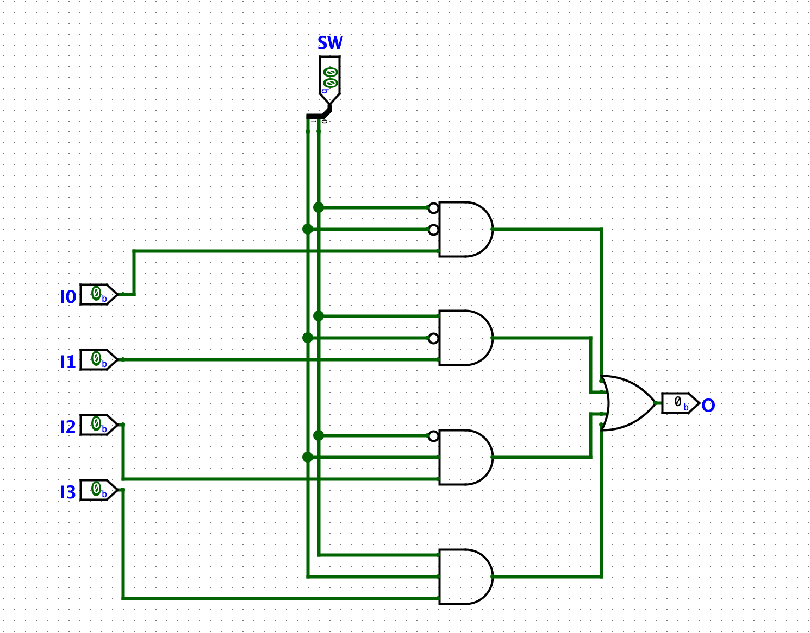
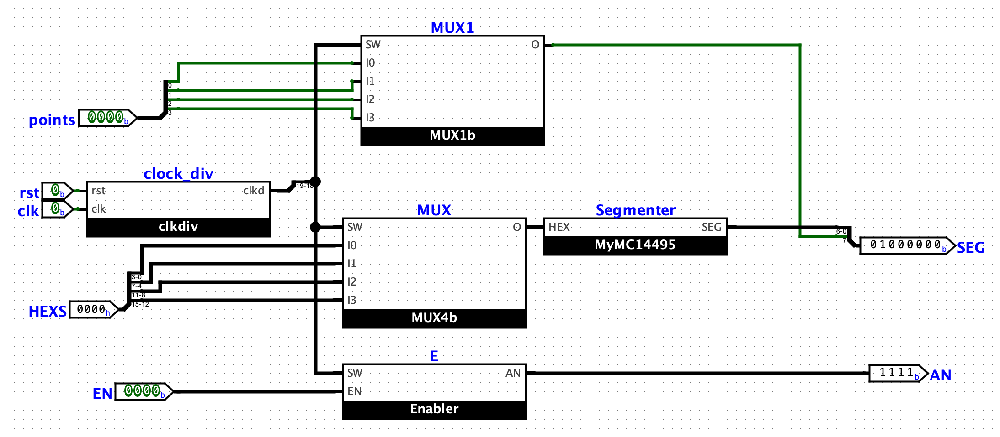

# 实验七  多路选择器设计及应用

## 一    实验目的

1. 了解 Sword 开发板的子板七段数码管交互
2. 熟悉了解多路选择器的原理
3. 用学会原理图的方式完成多路选择器

## 二    实验环境

1. EDA 工具： Logisim Evolution、Vivado
2. SWORD 开发板
3. 操作系统： Windows 10+

## 三    实验原理

### 1. 4选1多路选择器

4选1多路选择器的作用是，通过控制端S1、S2来控制输出端输出不同的输入端信号。

|信息输入|控制端|选择输出|
|-|-|-|
|I0 I1 I2 I3|S1 S0|输出项|
|I0 I1 I2 I3|0 0|I0|
|I0 I1 I2 I3|0 1|I1|
|I0 I1 I2 I3|1 0|I2|
|I0 I1 I2 I3|1 1|I3|



这里我们仅可以控制1位输入的4选1，如果我们需要实现多位输入的4选1，我们可以通过组合多个1位4选1多路选择器来实现。

### 2. 动态扫描显示器

由于一次仅能控制七段数码管显示一个数字，因此我们无法直接控制四个数码管同时展示同一个数字。

如果我们需要控制四个数码管分别显示不同的数字，我们应该怎么做呢。

因为在数码管上显示数字后不会马上消失，我们利用这点，通过控制使能，使得每次仅亮一个一个数码管，并通过用时钟来作为选择器，不断重复这个过程，类似于在不断的扫描四个数码管，并显示不同的数字，使得最后呈现四个数码管同时展示不同数字的效果。

| 时间 |使能|展示数字|
|-|-|-|
|0|1110|N0|
|1|1101|N1|
|2|1011|N2|
|3|0111|N3|
|4|1110|N0|
|5|1101|N1|
...

动态扫描显示器的原理图如下




请同学们在作图的时候思考，为什么这个动态扫描显示器可以做到扫描的功能。该模块的输入与输出解释如下：

**输入**

point：分别控制四个小数点是否亮

rst：控制时钟信号是否置零，正电平置零

clk：时钟信号，频率为100MHz

HEXS：16位，分成四组四位数，每组控制一个数码管的显示

EN：数码管的使能，全部置1使得所有数码管均显示

**输出**

SEG：控制当前七位数码管与小数的显示

AN：控制四个数码管的使能


## 四    实验步骤

### 1. 设计4选1多路选择器

根据实验原理的原理图，设计4选1多路选择器（4b和1b）。

### 2. 设计动态扫描显示器

使用 verilog 代码设计 clock_div 模块：该模块输出一个32位二进制数clkd，以0为初始值，并且每个时钟周期（clk正边沿）加一，在MUX等模块的SW输入端口，我们使用clkd[19:18]两个bit作为选择信号

根据动态扫描显示器的原理图，调用之前完成的4选1多路选择器，使用 Verilog 代码完成动态扫描显示器模块的设计

### 3.补全top模块

我们提供了 [top 模块](top7.v)，只需要保证模块名一致即可。

我们提供了一个 [Anti_jitter.v](Anti_jitter.v) 的代码，它用于处理rst信号，直接将它导入到 Design Sources 中即可。

（完成后通过[仿真测试](topSim7.v)，可选）

### 4.上板验证

补全约束文件，并上板测试。

新增相关引脚约束如下：

```
# clk
set_property PACKAGE_PIN AC18 [get_ports clk]
set_property IOSTANDARD LVCMOS18 [get_ports clk]

# BTNY
set_property PACKAGE_PIN V18 [get_ports {BTNY}]
set_property IOSTANDARD LVCMOS18 [get_ports {BTNY}]
set_property PACKAGE_PIN W16 [get_ports {BTNY}]
set_property IOSTANDARD LVCMOS18 [get_ports {BTNY}]
```


## 五    实验提交要求
1. 包含本实验所使用的所有 Logisim 电路图文件、Verilog 源文件、仿真激励文件和引脚约束文件的 zip 压缩包
2. 一份不超过 3 页的 PDF 格式的实验报告（无需封面），内容包含：
      - 多路选择器的设计思路以及一位四选一多路选择器的电路原理图截图。
      - 上板验证结果以及分析
      - 思考题，包含：
          1. 理解动态扫描原理的前提下，结合输入与输出，请解释为什么给出的动态扫描显示器的原理图可以做到动态扫描
          2. clock_div模块的作用是什么，为什么选用 clk[19:18] 作为SW信号输入
          3. 如果要实现16选1多路选择器，控制端应为几位，如果用Verilog代码来实现，哪个语法是最佳写法，请简单说明