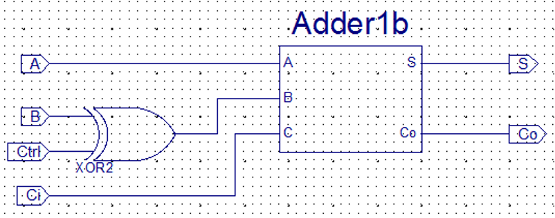
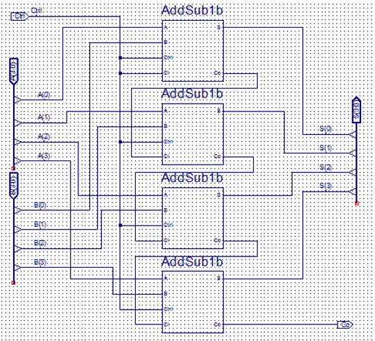

# 实验八  加减法器与ALU基本原理与设计
## 一    实验目的

1. 了解 Sword 开发板的子板七段数码管交互
2. 掌握加减法器的工作原理和逻辑功能
3. 掌握ALU的设计方法


## 二    实验环境

1. EDA 工具： Logisim Evolution、Vivado
2. SWORD 开发板
3. 操作系统： Windows 10+

## 三    实验原理

### 1. 1位全加器

1位全加器有$$三个输入端：数据位 A_i 和 B_i，低位进位输入 C_i$$

$$两个输出位：全加和 {S_i}，进位输出 C_{i+1}$$

$${S_i = A_i \bigotimes B_i \bigotimes C_i}$$

$${C_{i+1}=A_i B_i + B_iC_i + C_i A_i}$$

| $A_i$ | $B_i$ | $C_i$ | $S_i$ | $C_{i+1}$ |
|-|-|-|-|-|
|0|0|0|0|0|
|0|0|1|1|0|
|0|1|0|1|0|
|0|1|1|0|1|
|1|0|0|1|0|
|1|0|1|0|1|
|1|1|0|0|1|
|1|1|1|1|1|

### 2. 多位串行进位加法器与多位串行进位加减器

多位全加器可由一位全加器将进位串接构成

高位进位生成速度慢，位数越多时间越长


而多位串行进位加减器用负数补码加法实现，减数当作负数求补码

共用加法器，用“异或”门控制求反，低位进位C0为1


### 3. 加减法器

在上面我们已经完成一位全加器的设计，同时也了解了多位串行进位加法器和全减器的设计，我们发现如果将“异或”门加入一位全加器的设计中，可以让我们更简便的实现多位串行加减器。





### 4. ALU的基本原理与设计

ALU是CPU中的重要组件，ALU可以进行多种运算，通过控制端来进行控制，对两个输入端进行不同的运算，并得出结果。

在ALU模块中，我们将多个运算单元组合起来，并通过lab7的多路选择器对输出进行选择，所以在实际电路设计中，ALU会计算所有可能的结果，并最终只输出控制端选择的那个。

Verilog代码设计思想是行为描述设计，刚刚对ALU的行为进行描述，请根据刚刚的描述以及下面给出的模块头，设计一个支持加、减、按位与、按位或、按位异或、左移、右移、逻辑小于运算的ALU组件。

要求：模块头与所给一致，加、减部分要求调用之前设计的多位串行加减法器进行运算，运算符所控制的结果为：

提示：在Verilog中，存在运算符，多路选择器的行为与case语句一致。

| 运算符 | ALU行为 |
|-|-|
|3‘b000|加法：返回a+b|
|3’b001|减法：返回a-b|
|3‘b010|按位与：返回a和b按位取与的结果|
|3’b011|按位或：返回a和b按位取或的结果|
|3‘b100|左移：返回a左移b位的结果|
|3’b101|右移：返回a右移b位的结果|
|3‘b110|逻辑小于：如果a小于b返回1，否则返回0|
|3’b111|按位异或：返回a和b按位取异或的结果|

```
// 模块接口定义
module MyAlu(
    input [3:0] A,
    input [3:0] B,
    input [2:0] op,
    output [3:0] res
    );
```


## 四    实验步骤

### 1. 设计一位全加器

根据给出的真值表和表达式，用Verilog来设计全加器，并思考这样设计全加器和对照真值表用作图的方式设计有何区别。（行为描述设计和结构描述设计的区别）

### 2. 设计多位串行加减器

根据原理图，调用之前设计的一位全加器，用verilog设计四位串行加减器

### 3.设计算术逻辑单元(ALU)

根据所给的ALU行为描述与提示，按要求用Verilog代码设计ALU模型。

### 4.完成top模块

完成top模块，并在top模块中调用导入的动态扫描显示器模块。（需要通过仿真进行验证）

请在七段数码管的第一个数字（最右边）显示A，第二个数字显示B，第三个数字显示ALU计算结果

```
// 接口定义参考（提示：A=SW[3:0], B=SW[7:4], op=SW[10:8], 其他同lab7）
module top(
    input clk,
    input [10:0] SW,
    input BTNY,
    output [7:0] SEG,
    output [3:0] AN
    );
```

### 5.上板验证

完成约束文件，并上板测试。

## 五    实验提交要求
1. 包含本实验所使用的所有 Logisim 电路图文件、Verilog 源文件、仿真激励文件和引脚约束文件的 zip 压缩包
2. 一份不超过 3 页的 PDF 格式的实验报告（无需封面），内容包含：
      - 一位全加器和四位加法、减法器的电路原理图截图。
      - 上板验证结果以及分析
      - 思考题，包含：
          1. 用作图的方式设计一位全加器，请从设计思路、实现方式两个角度比较行为描述和结构描述两者的区别。
          2. 如果现在需要将操作端位宽改为4位，并使ALU多支持4种运算，请问该如何修改Verilog代码？如果新增一位输入rst，使rst=0时正常输出，rst=1时输出保持为0，该如何修改现有的Verilog代码。
